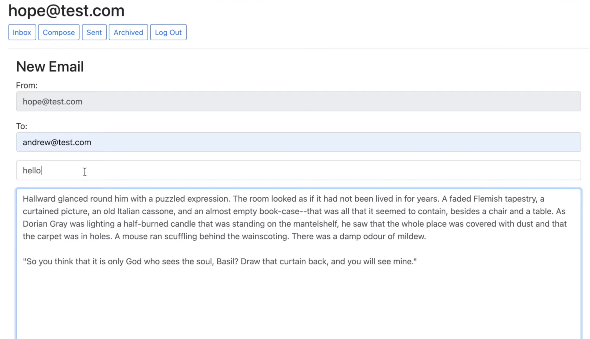

# Django Email Client

## Technologies
* Python
* Django
* JavaScript
* REST API
* HTML
* Bootstrap

## Summary
A JavaScript "email" client that allows logged-in users to view, get, and send messages to each other and mark messages archived/unarchived, moving them to a different mailbox view. These are messages stored in database and are not sent to real email servers. The application's Django framework and Python code were provided in the assignment starter code. The task for this assignment was to implement the front-end with JavaScript and HTML, using the application's API to get, put, and post data with **fetch.**

**video demo of the app [here](https://youtu.be/LAfUUua-gYM)**

---

---

Assignment starter code provided by Harvard's CS50. You can read the full assignment description on [CS50's OpenCourseWare](https://cs50.harvard.edu/web/2020/projects/3/mail/)

